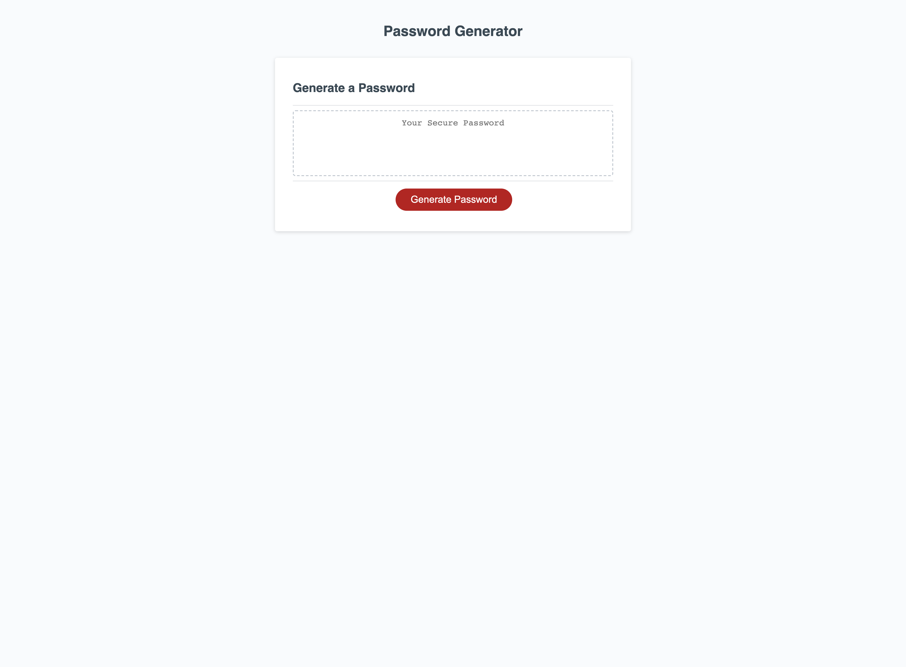
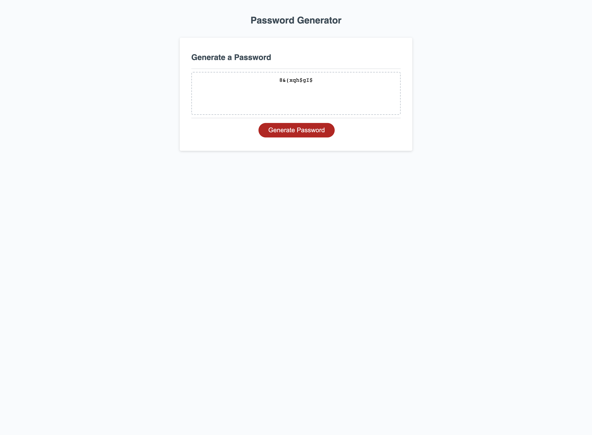

# Personal Portfolio: Random Password Generator 2023

## Description

This is a random password generator using javascript. The password generator uses prompts to allow certain characters based on what the user wants in their password including: numbers, special characters, lower case letters, and upper case letters. The user can also set the length of the password with a respective prompt. All passwords must be completed within certain parameters as displayed by the prompts and any password that does not meet these parameters will be met with an error message.

## Task completed

- Password displays when button is clicked
- Series of prompts are displayed asking about password criteria
- Criteria can be selected and applied to password
- Password will be generated between 8 and 128 characters
- Special characters, numbers, lower case letters, and upper case letters will be offered for password
- If prompt requirements are not met, then error prompt will appear
- If prompt requiremets are met, password is generated

## Link

[Link to deployed website](https://aarondreyer.github.io/Random-Password-Generator-2023/)

[Link to Repository](https://github.com/AaronDreyer/Random-Password-Generator-2023)

## Installation

Access application through github by deploying index.html, style.css, and README.md

Links above bring user to deployed page and github repository

## Usage

This application demonstrates basic javascript and how to use arrays, functions, conditional statements, and other javascript coding to produce a user friendly website with interactivity. This application can generate a password with crtieria selected by the user and will be met with error messaging if user does not follow application requirements.

 

## Deployed Screenshot

## Credits

Credit for the total completion of assignment include: TAs, instructor, and students of the 2022 Georgia Tech Coding Bootcamp. Their assistance allowed for the assignment to meet all requirements.

Following Websites were used:
- https://www.w3schools.com/css/css_rwd_mediaqueries.asp
- https://www.geeksforgeeks.org/css/
- https://github.com/leolopez10/random-password-generator
- https://github.com/jamierachael/Password-Generator
- https://www.udemy.com/cart/success/866729228/

## License

License provided by Georgia Tech Bootcamp.

External liscense not specified.

